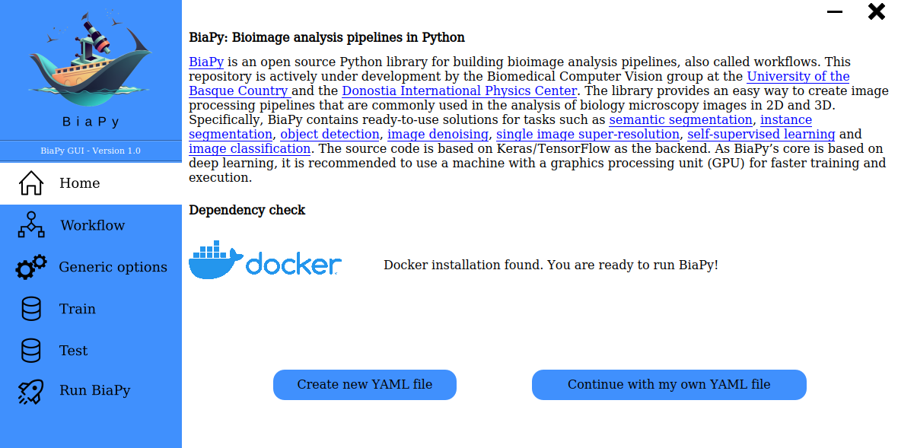

# Graphical user interface for BiaPy: Bioimage analysis pipelines in Python



[BiaPy](https://github.com/danifranco/BiaPy) is an open source Python library for building bioimage analysis pipelines. This repository is actively under development by the Biomedical Computer Vision group at the [University of the Basque Country](https://www.ehu.eus/en/en-home) and the [Donostia International Physics Center](http://dipc.ehu.es/). 

 
## Citation                                                                                                             
                                                                                                                        
This repository is the base of the following work:                                                                      
                                                                                                                        
```bibtex
@inproceedings{franco-barranco2023biapy,
    author = {Daniel Franco-Barranco and Jes{\'{u}}s A. Andr{\'{e}}s-San Rom{\'{a}}n and Pedro G{\'{o}}mez-G{\'{a}}lvez and Luis M. Escudero and Arrate Mu{\~n}oz-Barrutia and Ignacio Arganda-Carreras},
    title = {{BiaPy: a ready-to-use library for Bioimage Analysis Pipelines}},
    booktitle={2023 IEEE 20th International Symposium on Biomedical Imaging (ISBI 2023)},
    year={2023},
    organization={IEEE}
}
``` 